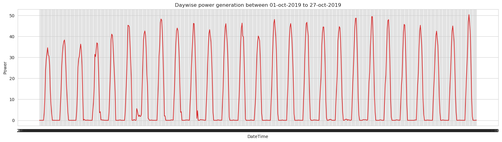

# Short-Term Power Forecasting Using LSTMs and Linear Regression      

This project predicts power irradiance one month in the future, based on current power irradiance and local weather conditions using an LSTM (long short-term memory) model and Linear Regression.

## Methods Used
- Machine Learning
- Data Visualization
- Predictive Modeling
## Technologies
- Python
- Keras
- Pandas, jupyter

## Data
### power_actual

This file contains the solar generation of a certain plant from October 1st, 2017 to September 30th, 2019.
You'll find the following columns: 'power', 'gti' and 'ghi'. Power is the actual power generated while GHI (Global Horizontal Irradiance) and GTI (Global Tilt Irradiance) are the parameters relevant to the that define the radiation received from the sun.      

### weather_actuals

This file contains the weather data of the same plant from October 1st, 2017 to September 30th, 2019.
The columns' names are self-explanatory.  

### weather_forecast

This file contains the weather data from October 1st, 2019 to October 27th, 2019.       

You need to predict the generation of power of the given plan in this duration: October 1st, 2019 to October 27th, 2019.

## Getting Started
1. Clone this repo    

2. See [Notebook 1: Solar_Generation](https://github.com/shubhamchouksey/Power-Prediction-LSTM/blob/master/Solar_Generation.ipynb) to examine raw data, EDA, preliminary cleaning steps, feature engineering, modeling, and evaluation of predictions.

3. See [Notebook 2: Technical Report](https://github.com/shubhamchouksey/Power-Prediction-LSTM/blob/master/Technical_Report.ipynb) for an overview of the project.

## Result 

## Reference:
https://towardsdatascience.com/illustrated-guide-to-lstms-and-gru-s-a-step-by-step-explanation-44e9eb85bf21
